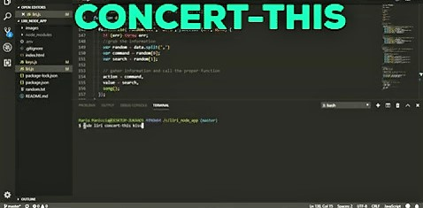

<h1>LIRI</h1>
 
<h2>The Language Interpretation and Recognition Interface</h2>
 

LIRI is a command line node app that takes in parameters and gives back data.

<h3>::Commands::</h3>
 
<h3>1. concert-this</h3>

When you enter: "node liri concert-this ARTIST/BAND NAME" into the terminal, Liri will return the next three concerts information for the band or artist you entered. If that band is not on tour, the terminal will inform you.

<h4>Example:</h4>

<h3>2. spotify-this-song</h3>

When you enter: "node liri spotify-this-song SONG TITLE" into the terminal, Liri returns the following information about the song in your terminal/bash window:

<ul>
<li>Artist(s)</li> 
<li>The song's name</li>
<li>A preview link of the song from Spotify</li>
<li>The album that the song is from</li>
</ul>

<h4>Example:</h4>
Format: 

<h3>3. movie-this</h3>

When you enter: "node liri.js movie-this MOVIE NAME" into the terminal, Liri will give you the following information about the specified film:

<ul>
<li>Title of the movie.</li>
<li>Year the movie came out.</li>
<li>IMDB Rating of the movie.</li>
<li>Rotten Tomatoes Rating of the movie.</li>
<li>Country where the movie was produced.</li>
<li>Language of the movie.</li>
<li>Plot of the movie.</li>
<li>Actors in the movie.</li>
</ul>

<h4>Example:</h4>
Format: 

<h3>4. do-what-it-says</h3>

This command uses the termial and the fs module to pull the information from the random.txt file and populate information. In this example, the random.txt file contains the following:

<h5>spotify-this-song,"I Want it That Way"</h5>

<h4>and Liri returns:</h4>
Format: 
